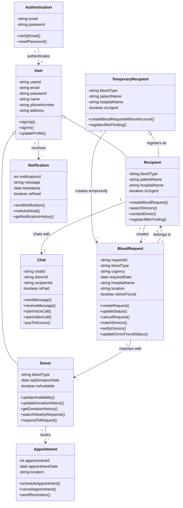

```mermaid
classDiagram
    class User {
        -string userId
        -string email
        -string password
        -string name
        -string phoneNumber
        -string address
        +signUp()
        +signIn()
        +updateProfile()
    }

    class Donor {
        -string bloodType
        -date lastDonationDate
        -boolean isAvailable
        +updateAvailability()
        +updateDonationHistory()
        +getDonationHistory()
        +searchNearbyRequests()
        +respondToRequest()
    }

    class Recipient {
        -string bloodType
        -string patientName
        -string hospitalName
        -boolean isUrgent
        +createBloodRequest()
        +searchDonors()
        +contactDonor()
        +registerAfterFinding()
    }

    class TemporaryRecipient {
        -string bloodType
        -string patientName
        -string hospitalName
        -boolean isUrgent
        +createBloodRequestWithoutAccount()
        +registerAfterFinding()
    }

    class BloodRequest {
        -string requestId
        -string bloodType
        -string urgency
        -date requiredDate
        -string hospitalName
        -string location
        -boolean donorFound
        +createRequest()
        +updateStatus()
        +cancelRequest()
        +matchDonors()
        +notifyDonors()
        +updateDonorFoundStatus()
    }

    class Appointment {
        -int appointmentId
        -date appointmentDate
        -string location
        +scheduleAppointment()
        +cancelAppointment()
        +sendReminders()
    }

    class Authentication {
        -string email
        -string password
        +verifyEmail()
        +resetPassword()
    }

    class Notification {
        -int notificationId
        -string message
        -date timestamp
        -boolean isRead
        +sendNotification()
        +markAsRead()
        +getNotificationHistory()
    }

    class Chat {
        -string chatId
        -string donorId
        -string recipientId
        -boolean isPaid
        +sendMessage()
        +receiveMessage()
        +startVoiceCall()
        +startVideoCall()
        +payToAccess()
    }

    User <|-- Donor
    User <|-- Recipient
    TemporaryRecipient <|-- Recipient : registers as
    TemporaryRecipient "1" --> "*" BloodRequest : creates temporarily
    Recipient "1" --> "*" BloodRequest : creates
    Donor "1" --> "*" Appointment : books
    Authentication "1" --> "1" User : authenticates
    BloodRequest "1" --> "*" Donor : matches with
    User "1" --> "*" Notification : receives
    BloodRequest "1" --> "1" Recipient : belongs to
    Recipient "1" --> "1" Chat : chats with

```
